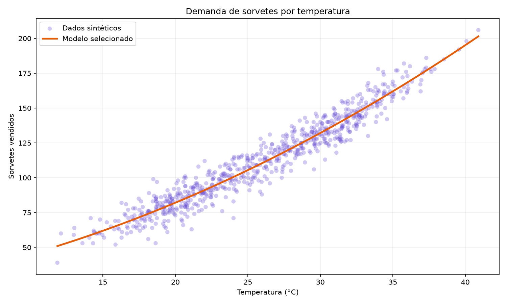
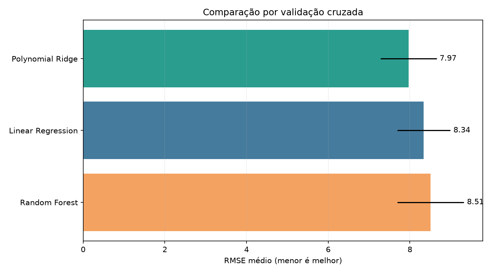
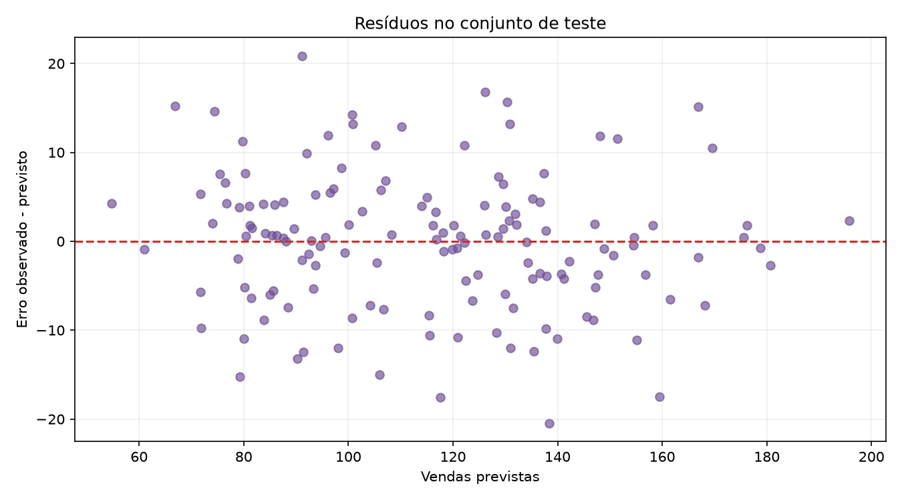
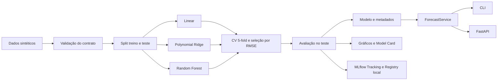

# 🍦 Gelato Demand Forecast

Pipeline reproduzível de Machine Learning para prever a quantidade diária de sorvetes vendidos
a partir da temperatura, com comparação de regressões, MLflow, API FastAPI, testes, Docker e
preparação documentada para Azure.

> Os dados deste projeto são **sintéticos e determinísticos**. Eles não representam vendas de
> uma empresa real e não devem ser apresentados como evidência de desempenho comercial.

## Resultado em uma frase

Entre três candidatos, a validação cruzada selecionou uma **regressão polinomial de grau 2 com
Ridge**, que obteve **MAE 5,9051**, **RMSE 7,6666** e **R² 0,932370** no conjunto de teste.

## Sumário

- [Problema e objetivo](#problema-e-objetivo)
- [Resultados reproduzidos](#resultados-reproduzidos)
- [Arquitetura](#arquitetura)
- [Tecnologias](#tecnologias)
- [Como executar](#como-executar)
- [MLflow](#mlflow)
- [Previsões](#previsões)
- [API](#api)
- [Docker](#docker)
- [Testes e qualidade](#testes-e-qualidade)
- [Estrutura do repositório](#estrutura-do-repositório)
- [Dados e metodologia](#dados-e-metodologia)
- [Insights e aprendizados](#insights-e-aprendizados)
- [Limitações](#limitações)
- [Possibilidades de evolução](#possibilidades-de-evolução)
- [Azure](#azure)
- [Documentação](#documentação)

## Problema e objetivo

Uma sorveteria precisa antecipar a demanda para organizar produção, estoque e equipe. Neste
projeto, a temperatura é usada como única variável explicativa para estimar o total diário de
sorvetes vendidos.

O objetivo técnico é demonstrar um ciclo de ML completo e auditável:

1. gerar ou carregar dados;
2. validar o contrato do dataset;
3. treinar e comparar modelos de regressão;
4. selecionar o campeão por validação cruzada;
5. avaliar uma única vez em um conjunto de teste separado;
6. registrar parâmetros, métricas e artefatos com MLflow;
7. persistir modelo e metadados;
8. oferecer inferência pela CLI e por uma API;
9. automatizar testes, lint, auditoria e build do contêiner.

## Resultados reproduzidos

A execução documentada usa 730 dias, semente `42`, divisão de 80% para treino e 20% para teste
e validação cruzada K-fold com cinco divisões no conjunto de treino.

### Comparação dos candidatos

| Posição | Modelo | CV RMSE médio | Desvio padrão |
|---:|---|---:|---:|
| 1 | Polynomial Ridge | **7,9670** | 0,6873 |
| 2 | Regressão Linear | 8,3394 | 0,6517 |
| 3 | Random Forest | 8,5059 | 0,8166 |

O Polynomial Ridge reduziu o RMSE de validação em aproximadamente **4,47%** diante da regressão
linear e **6,34%** diante da Random Forest neste dataset e neste protocolo. Esses percentuais
não devem ser extrapolados para dados reais.

### Avaliação do campeão no teste

| Métrica | Resultado | Interpretação |
|---|---:|---|
| MAE | **5,9051** | erro absoluto médio de cerca de 5,9 sorvetes |
| RMSE | **7,6666** | penaliza mais fortemente os maiores erros |
| R² | **0,932370** | 93,24% da variância do teste foi explicada |

- registros de treino: `584`;
- registros de teste: `146`;
- faixa observada no treino: `11,86 °C` a `40,90 °C`;
- modelo selecionado: `polynomial_ridge`.

Os valores completos estão em [`reports/metrics.json`](reports/metrics.json) e as ressalvas de
uso estão no [`Model Card`](reports/MODEL_CARD.md). A integridade dos artefatos versionados pode
ser verificada com `sha256sum --check ARTIFACTS.sha256`.

### Evidências visuais

#### Demanda por temperatura



#### Comparação por validação cruzada



#### Resíduos no conjunto de teste



## Arquitetura



A API e a CLI usam o mesmo `ForecastService`; assim, regras de validação, arredondamento,
intervalo e extrapolação não são reimplementadas em cada interface. Veja a explicação completa
em [`docs/ARCHITECTURE.md`](docs/ARCHITECTURE.md).

## Tecnologias

- Python 3.12 a 3.14;
- pandas e NumPy;
- scikit-learn;
- MLflow Tracking e Model Registry local;
- FastAPI, Pydantic e Uvicorn;
- Matplotlib;
- pytest e pytest-cov;
- Ruff;
- pip-audit;
- Docker e Docker Compose;
- GitHub Actions;
- Bicep e esqueletos Azure ML para evolução futura.

As versões diretas estão fixadas em [`pyproject.toml`](pyproject.toml).

## Como executar

### 1. Pré-requisitos

- Python `>=3.12,<3.15`;
- Git;
- Docker opcional.

### 2. Criar o ambiente

Linux ou macOS:

```bash
python3 -m venv .venv
source .venv/bin/activate
python -m pip install --upgrade pip
python -m pip install -e '.[dev]'
```

PowerShell:

```powershell
py -3.13 -m venv .venv
.venv\Scripts\Activate.ps1
python -m pip install --upgrade pip
python -m pip install -e ".[dev]"
```

### 3. Executar o pipeline local

```bash
python scripts/run_pipeline.py
```

O pipeline cria ou atualiza:

- `data/ice_cream_sales.csv`;
- `models/model.joblib`;
- `models/metadata.json`;
- `reports/metrics.json`;
- `reports/MODEL_CARD.md`;
- três gráficos em `reports/images/`.

Saída esperada para a configuração padrão:

```json
{
  "selected_model": "polynomial_ridge",
  "metrics": {
    "mae": 5.9051,
    "rmse": 7.6666,
    "r2": 0.93237
  }
}
```

O caminho exibido para o modelo varia conforme o diretório onde o projeto foi clonado.

### Atalhos opcionais com Make

```bash
make install
make pipeline
make check
```

## MLflow

O comando abaixo treina, registra parâmetros e métricas, anexa artefatos, salva uma assinatura
de inferência e cria uma versão no Model Registry local:

```bash
gelato-forecast train
```

Abrir a interface:

```bash
mlflow ui --backend-store-uri sqlite:///mlflow.db --host 127.0.0.1 --port 5000
```

Acesse `http://127.0.0.1:5000` no mesmo computador.

O fluxo foi validado localmente e criou a versão 1 de `gelato-demand-model`. O banco
`mlflow.db` e o diretório interno de artefatos são locais e deliberadamente não são versionados.
Mais detalhes: [`docs/MLFLOW.md`](docs/MLFLOW.md).

Opções úteis:

```bash
# Rastrear a run sem registrar uma versão
gelato-forecast train --no-register

# Treinar sem MLflow
gelato-forecast train --no-mlflow
```

## Previsões

### Uma temperatura

```bash
gelato-forecast predict 30
```

Resposta do artefato incluído neste repositório:

```json
{
  "temperature_c": 30.0,
  "predicted_sales": 132,
  "prediction_interval_95": [117, 147],
  "model_name": "polynomial_ridge",
  "warning": null
}
```

### Lote

```bash
gelato-forecast batch-predict inputs/sample_temperatures.txt
```

A pasta [`inputs`](inputs/) contém:

- temperaturas, uma por linha;
- requisições JSON de exemplo;
- sentenças em português que descrevem temperaturas.

As sentenças atendem à exigência estrutural do enunciado original, mas não são processadas por
NLP: neste desafio coerente, os números de temperatura são transformados em requisições de
regressão.

## API

Inicie o serviço:

```bash
gelato-forecast serve --host 0.0.0.0 --port 8000
```

Rotas:

| Método | Rota | Finalidade |
|---|---|---|
| `GET` | `/` | identificação e versão |
| `GET` | `/health` | prontidão dos artefatos |
| `POST` | `/predict` | previsão unitária |
| `GET` | `/docs` | Swagger UI gerado pelo FastAPI |

Exemplo:

```bash
curl --fail --request POST http://127.0.0.1:8000/predict \
  --header 'Content-Type: application/json' \
  --data '{"temperature_c":30.0}'
```

O corpo é estrito: campos extras e números enviados como texto são rejeitados. O intervalo
operacional é de -20 °C a 60 °C. Dentro desse limite, uma temperatura fora da faixa observada
no treino recebe um aviso de extrapolação.

Contrato completo: [`docs/API.md`](docs/API.md).

## Docker

A imagem executa como usuário sem privilégios e possui healthcheck. O Compose também remove
capabilities Linux, bloqueia novos privilégios e deixa o filesystem somente para leitura.

### Docker Compose

```bash
docker compose up --build
```

A API fica em `http://127.0.0.1:8000`. Para mudar a porta do host:

```bash
GELATO_API_PORT=8080 docker compose up --build
```

### Docker CLI

```bash
docker build --tag gelato-demand-forecast:local .
docker run --rm --publish 8000:8000 gelato-demand-forecast:local
```

## Testes e qualidade

Validação completa:

```bash
ruff format --check src tests scripts
ruff check src tests scripts
pytest -q --cov=gelato_forecast --cov-report=term-missing --cov-report=xml
pip-audit --skip-editable
pip check
```

Resultado local confirmado:

```text
51 passed
TOTAL 474 statements, 70 branches, 100% coverage
No known vulnerabilities found
No broken requirements found
```

A cobertura considera todos os módulos da aplicação e exclui somente o pequeno entrypoint
`__main__.py`, conforme configuração explícita. O limiar obrigatório é 95%.

A CI repete lint e testes em Python 3.12, 3.13 e 3.14, audita dependências, constrói o wheel,
constrói a imagem Docker e executa um smoke test real da API. A configuração está em
[`.github/workflows/ci.yml`](.github/workflows/ci.yml).

## Estrutura do repositório

```text
.
├── .github/                  # CI, Dependabot e templates
├── data/                     # dataset sintético reproduzido
├── deploy/azureml/           # esqueletos para evolução no Azure ML
├── docs/                     # arquitetura, API, MLflow, Azure e entrega DIO
├── infra/azure/              # infraestrutura Bicep não implantada
├── inputs/                   # entradas de exemplo
├── models/                   # campeão e metadados versionados
├── reports/                  # métricas, Model Card e gráficos
├── scripts/run_pipeline.py   # pipeline local completo
├── src/gelato_forecast/      # pacote Python
├── tests/                    # 51 testes automatizados
├── compose.yaml
├── Dockerfile
├── Makefile
├── pyproject.toml
└── README.md
```

## Dados e metodologia

### Geração dos dados

A base tem 730 datas diárias a partir de 2024-01-01. A temperatura combina sazonalidade anual
e ruído aleatório com semente fixa. A demanda contém:

- componente linear da temperatura;
- componente quadrático;
- bônus de fim de semana não fornecido ao modelo;
- ruído que representa efeitos não observados.

Essa escolha cria uma relação plausível para fins didáticos sem fabricar a narrativa de dados
reais. O bônus omitido e o ruído impedem um ajuste artificialmente perfeito.

### Contrato validado

Antes do treino, o pipeline exige:

- colunas `date`, `temperature_c` e `ice_creams_sold`;
- no mínimo 50 linhas;
- datas válidas e únicas;
- ausência de nulos;
- temperatura entre -10 °C e 55 °C;
- vendas entre 0 e 1.000 unidades.

### Estratégia de seleção

- split treino/teste reproduzível;
- cinco folds com embaralhamento somente no conjunto de treino;
- escolha pelo menor RMSE médio de validação;
- teste usado apenas para a estimativa final do campeão;
- MAE, RMSE e R² reportados em conjunto.

O hash SHA-256 do CSV é registrado em cada run do MLflow, permitindo associar a execução à
entrada exata.

## Insights e aprendizados

1. **A relação não é puramente linear.** A expansão quadrática venceu porque a curva geradora
   apresenta aceleração da demanda em temperaturas mais altas.
2. **Maior complexidade não garantiu melhor resultado.** A Random Forest ficou atrás das duas
   regressões neste cenário pequeno e de uma única feature.
3. **Validação cruzada evita escolher pelo acaso de um único split.** O campeão é definido pelo
   desempenho médio em cinco folds do treino, não pela métrica do teste.
4. **A métrica precisa de contexto.** R² alto não elimina um erro médio de aproximadamente seis
   unidades nem representa resultado real de negócio.
5. **Inferência também precisa de contrato.** Tipagem estrita, limite operacional e aviso de
   extrapolação evitam que uma previsão numérica pareça válida em qualquer situação.
6. **Rastreabilidade faz parte do modelo.** Código sem dataset, parâmetros, assinatura e
   metadados não forma um experimento reproduzível.
7. **Dados honestamente rotulados são melhores que evidências inventadas.** O projeto prefere
   explicitar a simulação a sugerir experiência comercial ou implantação que não ocorreram.

## Limitações

- temperatura é a única feature conhecida pelo modelo;
- chuva, preço, promoções, feriados, estoque, localização e concorrência não são usados;
- os dados são sintéticos e podem favorecer a família polinomial que participa da geração;
- o split aleatório mede generalização dentro da distribuição, não um backtest temporal;
- o intervalo de 95% é uma aproximação baseada no desvio global dos resíduos, não um intervalo
  condicional calibrado;
- extrapolações mantêm maior incerteza, mesmo quando aceitas pelo limite operacional;
- `joblib` depende de versões compatíveis e só deve carregar arquivos confiáveis;
- a API educacional não implementa autenticação, rate limiting ou observabilidade de produção.

## Possibilidades de evolução

- substituir a base sintética por vendas reais governadas;
- incluir precipitação, sensação térmica, feriados, promoções, preço e estoque;
- usar divisão temporal e backtesting com janelas móveis;
- adicionar baseline sazonal e modelos de séries temporais;
- calibrar intervalos com regressão quantílica ou conformal prediction;
- monitorar drift de entrada, qualidade, latência e erro pós-produção;
- armazenar artefatos em registry protegido e validá-los por digest;
- adicionar autenticação, rate limiting, logs estruturados e tracing;
- criar promoção automatizada por critérios de qualidade e aprovação;
- executar testes de carga e estratégia de canary/rollback.

## Azure

O projeto contém Bicep para uma futura API no Azure Container Apps e esqueletos de ambiente e
job para Azure Machine Learning. O Bicep foi compilado localmente e os YAMLs passaram pela
validação de schema. **Nada foi implantado.** Não existe assinatura usada, workspace, endpoint
público, URL de nuvem nem captura de tela de recurso Azure.

Os pré-requisitos, comandos de referência e controles de produção estão documentados em
[`docs/AZURE_DEPLOYMENT.md`](docs/AZURE_DEPLOYMENT.md).

## Documentação

- [Arquitetura e decisões](docs/ARCHITECTURE.md)
- [Contrato da API](docs/API.md)
- [Rastreamento com MLflow](docs/MLFLOW.md)
- [Preparação futura para Azure](docs/AZURE_DEPLOYMENT.md)
- [Texto e evidências para a entrega DIO](docs/DIO_SUBMISSION.md)
- [Metadados sugeridos para o GitHub](docs/GITHUB_REPOSITORY.md)
- [Model Card](reports/MODEL_CARD.md)
- [Política de segurança](SECURITY.md)
- [Como contribuir](CONTRIBUTING.md)
- [Changelog](CHANGELOG.md)

## Licença

Distribuído sob a licença MIT. Consulte [`LICENSE`](LICENSE).
