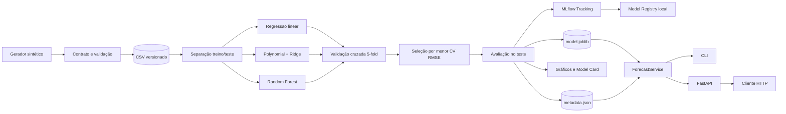

# Arquitetura

## Visão geral

O projeto separa geração e validação de dados, treinamento, rastreamento, persistência e
inferência. Essa divisão permite executar o mesmo núcleo pela CLI, pelos testes e pela API,
sem duplicar a lógica de negócio.

## Componentes

| Componente | Responsabilidade |
|---|---|
| `data.py` | gerar dados determinísticos e validar o contrato tabular |
| `modeling.py` | criar candidatos, validar, selecionar, avaliar e persistir |
| `tracking.py` | registrar parâmetros, hash do dataset, métricas, artefatos e modelo no MLflow |
| `pipeline.py` | orquestrar o caminho local reproduzível |
| `service.py` | carregar artefatos uma vez e aplicar regras de inferência |
| `api.py` | expor contrato HTTP tipado com OpenAPI |
| `cli.py` | oferecer geração, treino, previsão unitária, lote e servidor |
| `plotting.py` | produzir gráficos sem depender de interface gráfica |

## Fluxo de treinamento

1. Se o CSV não existe, são gerados 730 dias com semente fixa.
2. O contrato exige data única, temperatura numérica entre -10 °C e 55 °C, vendas inteiras
   não negativas e pelo menos 50 registros.
3. Uma separação reproduzível reserva 20% para teste.
4. Os três candidatos são comparados apenas no conjunto de treino, com validação cruzada
   K-fold embaralhada e semente fixa.
5. O menor RMSE médio de validação define o campeão.
6. O campeão é ajustado no conjunto de treino e avaliado uma única vez no teste.
7. Modelo, metadados, métricas, gráficos e Model Card são persistidos.
8. Na execução com MLflow, os mesmos artefatos são vinculados a uma run e, opcionalmente,
   registrados no Model Registry local.

## Fluxo de inferência

`ForecastService` é a fronteira única de inferência. Ele:

- exige o modelo e os metadados;
- rejeita tipos, valores infinitos e temperaturas fora do limite operacional;
- arredonda vendas para unidades inteiras e impede resultado negativo;
- calcula um intervalo aproximado de 95% a partir do desvio dos resíduos de teste;
- sinaliza extrapolação quando a temperatura não apareceu na faixa de treinamento.

A API e a CLI usam exatamente esse serviço, reduzindo divergência entre interfaces.

## Decisões de projeto

### Por que dados sintéticos?

O desafio não fornece dados comerciais. Em vez de rotular uma base inventada como real,
o projeto gera uma série explícita, determinística e auditável. O ruído e o bônus de fim de
semana simulam fatores não presentes na única feature usada pelo modelo.

### Por que manter somente temperatura como feature?

É o requisito central do desafio e mantém a demonstração didática. O efeito de fim de semana
fica propositalmente não observado, evitando métricas artificialmente perfeitas e ilustrando
variáveis omitidas.

### Por que `PolynomialFeatures + Ridge`?

A relação geradora contém curvatura. A expansão quadrática captura essa forma e o Ridge
regulariza os coeficientes. A escolha não é fixa por regra: ela acontece por validação cruzada.

### Por que um intervalo aproximado?

O intervalo `previsão ± 1,96 × desvio dos resíduos` comunica incerteza sem fingir ser um
intervalo condicional rigoroso. A limitação fica explícita no Model Card. Uma evolução seria
regressão quantílica ou conformal prediction.

## Limites de confiança

Os arquivos `joblib` usam serialização baseada em pickle e só devem ser carregados de uma
fonte confiável. Dados, modelo e metadados versionados são demonstrativos. Para produção,
seriam necessários armazenamento de artefatos protegido, assinatura/verificação de modelo,
monitoramento de drift, autenticação, TLS na borda e dados reais validados.
